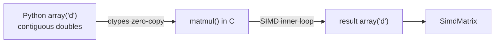

# Understanding the C SIMD Matrix Multiplication Kernel

This tutorial explains [`matmul.c`](../matmul.c) line by line: what `memset` is,
how the row-major memory layout works, why the loop order matters, and how the
compiler turns the inner loop into SIMD instructions.

If you have only used Python, this is the file that shows *why* NumPy is fast:
the whole multiplication happens in one tight loop of native machine code
instead of the Python interpreter.

---

## 1. The problem: `C = A × B`

We multiply an `m × n` matrix `A` by an `n × p` matrix `B` to get an `m × p`
matrix `C`. The mathematical definition of each output element is:

$$C_{ij} = \sum_{k=0}^{n-1} A_{ik} \cdot B_{kj}$$

Every cell of `C` is a **dot product** of a row of `A` and a column of `B`.

---

## 2. How the matrices are stored: contiguous, row-major memory

In Python you might picture a matrix as a list of lists:

```python
A = [[1, 2, 3],
     [4, 5, 6]]
```

In C we store the **same data as one flat block of `double`s**, laid out one row
after another. This is called **row-major** (or **C-order**) layout:

```
A = 1 2 3 4 5 6
    └─row 0─┘ └─row 1─┘
```

To find element `(r, c)` of a matrix with `Y` columns you compute its index:

$$\text{index} = r \times Y + c$$

That is exactly what these lines do:

```c
const double *a_row = A + (size_t)i * n;  // start of row i of A
double       *c_row = C + (size_t)i * p;  // start of row i of C
const double *b_row = B + (size_t)k * p;  // start of row k of B
```

`a_row`, `b_row` and `c_row` are **pointers** to the first element of a row.
`a_row[j]` then reads the j-th element of that row. This single contiguous
block is the same idea NumPy uses for its internal `.data` buffer, and it is why
the CPU cache and the vectorizer can work efficiently.

> **Why `(size_t)`?** `size_t` is an unsigned integer type big enough to address
> any object in memory. Casting to it before multiplying (`i * n`) prevents
> integer overflow for very large matrices, which could otherwise wrap around
> and compute a wrong (or negative) offset.

---

## 3. What is `memset`?

```c
memset(C, 0, (size_t)m * (size_t)p * sizeof(double));
```

`memset` is a standard C library function (from `<string.h>`) that **fills a
region of memory with a single byte value**. Its signature is:

```c
void *memset(void *dest, int byte_value, size_t num_bytes);
```

- `dest` — a pointer to the start of the memory to fill (`C`, our output buffer).
- `byte_value` — the byte to write into every position (`0` here).
- `num_bytes` — **how many bytes** to write. Note: *bytes*, not elements!

### Why bytes, and why `* sizeof(double)`?

`memset` works at the level of raw bytes. Our buffer holds `m * p` **doubles**,
and each `double` is `sizeof(double)` = 8 bytes. So the total number of bytes is:

$$m \times p \times 8$$

That is why we multiply by `sizeof(double)`. Forgetting it would zero only 1/8th
of the buffer.

### Why does writing zero *bytes* give `0.0`?

Filling every byte with `0` produces the bit pattern `00000000...0`. For an
IEEE-754 floating-point `double`, that all-zeros bit pattern happens to
represent exactly `0.0`. So one `memset` correctly initializes every cell of `C`
to `0.0` — fast, and usually itself optimized to SIMD by the C library.

### Why do we need to zero `C` at all?

The algorithm **accumulates** results with `+=`:

```c
c_row[j] += a_ik * b_row[j];
```

The very first time we touch `c_row[j]` it must already hold `0.0`, otherwise we
would be adding onto whatever random leftover value was in that memory. `memset`
guarantees a clean slate. (In this project the buffer already comes from Python
zero-initialized, but the kernel zeroes it too so it is correct on its own.)

---

## 4. The loop order: why `ikj` and not `ijk`

The "textbook" triple loop uses the order **i, j, k**:

```c
for i:
  for j:
    for k:
      C[i][j] += A[i][k] * B[k][j];   // B[k][j] jumps down a column!
```

The problem: `B[k][j]` walks **down a column** of `B`. In row-major memory,
consecutive elements of a column are `p` doubles apart (a big stride). That
thrashes the cache and cannot be vectorized well.

Our kernel swaps the last two loops into the order **i, k, j**:

```c
for (int i = 0; i < m; ++i)          // pick a row of A / C
  for (int k = 0; k < n; ++k)        // pick a shared index
    for (int j = 0; j < p; ++j)      // sweep across the row
      c_row[j] += a_ik * b_row[j];   // both stride 1 (unit stride)
```

Now the inner loop reads `b_row[j]` and writes `c_row[j]` with **stride 1** —
consecutive addresses in memory. Sequential (unit-stride) access is:

1. **Cache-friendly** — the CPU prefetcher loads the next cache line ahead of time.
2. **Vectorizable** — the compiler can load 2, 4, or 8 doubles at once.

The scalar `a_ik = a_row[k]` is read **once** and reused across the whole inner
loop, so it stays in a register.

---

## 5. `restrict`: the promise that unlocks SIMD

```c
void matmul(const double *restrict A,
            const double *restrict B,
            double       *restrict C, ...)
```

`restrict` is a promise to the compiler: *"these pointers never point to
overlapping memory."* Without it, the compiler must worry that writing to
`C[j]` might secretly change `A` or `B` (pointer aliasing), so it is forced to
reload values and cannot safely process several elements in parallel.

With `restrict`, the compiler knows the buffers are independent and is free to
vectorize the inner loop. It is the caller's responsibility to honor the
promise — in our project A, B and C are always separate buffers.

---

## 6. Turning the inner loop into SIMD

```c
#pragma clang loop vectorize(enable) interleave(enable)
for (int j = 0; j < p; ++j) {
    c_row[j] += a_ik * b_row[j];
}
```

**SIMD** = *Single Instruction, Multiple Data*: one CPU instruction that operates
on a small vector of values at once (e.g. 2 doubles with ARM NEON, 4 with AVX2,
8 with AVX-512). The operation here is a **fused multiply-add** (FMA):
`c += a_ik * b`.

- `vectorize(enable)` — hint to process several `j` values per instruction.
- `interleave(enable)` — hint to unroll across multiple vector registers to hide
  latency and keep the CPU pipeline full.

These are only *hints*; the real enabling work is done by the compiler flags in
the [`Makefile`](../Makefile):

```make
CFLAGS := -O3 -march=native -ffast-math -funroll-loops -fPIC -shared
```

- `-O3` — aggressive optimization, including the auto-vectorizer.
- `-march=native` — target this exact CPU, so the compiler may emit its best
  SIMD instructions (NEON on Apple Silicon, AVX/AVX-512 on modern x86-64).
- `-ffast-math` — allow reordering floating-point additions (needed because
  SIMD sums numbers in a different grouping than a strict left-to-right loop).
- `-funroll-loops` — unroll loops to expose more parallelism.
- `-fPIC -shared` — build a shared library that Python's `ctypes` can load.

---

## 7. How Python calls this C code

The compiled shared library (`libmatmul.dylib` on macOS, `libmatmul.so` on
Linux) is loaded from [`simd_matrix.py`](../simd_matrix.py) using `ctypes`,
part of the Python standard library. The matrix data lives in a flat
`array('d')` (contiguous doubles), and `ctypes` hands the **raw buffer
pointers** to `matmul` with **zero copying**:

```python
a_buf = (ctypes.c_double * len(self._data)).from_buffer(self._data)
lib.matmul(a_buf, b_buf, c_buf, m, n, p)
```

So the flow is:



---

## 8. The payoff

Because the inner loop runs as native SIMD instructions instead of interpreted
Python bytecode, this kernel is roughly **300× faster** than the naive
list-of-lists Python version on a 256×256 multiply (see `make bench`). That gap
is the whole reason libraries like NumPy are written in C: **contiguous memory +
a vectorized native loop**.

---

## 9. Quick reference

| Concept | What it does | Where in the code |
| --- | --- | --- |
| Row-major layout | `element (r,c) → r*cols + c` | pointer math `A + i*n` |
| `memset` | fill bytes with `0` → `0.0` doubles | line clearing `C` |
| `sizeof(double)` | 8 bytes per element (bytes ≠ elements) | `memset` size arg |
| `size_t` cast | avoid int overflow on big matrices | offset computations |
| `restrict` | "pointers don't overlap" → enables SIMD | function parameters |
| ikj order | unit-stride inner loop | the three nested loops |
| `#pragma clang loop` | vectorize/interleave hint | above the `j` loop |
| `-O3 -march=native` | actually emit SIMD instructions | `Makefile` `CFLAGS` |

---

## 10. Build and run it yourself

```sh
make libmatmul   # compile matmul.c into the shared library
make bench       # run the four-way speed comparison
```
